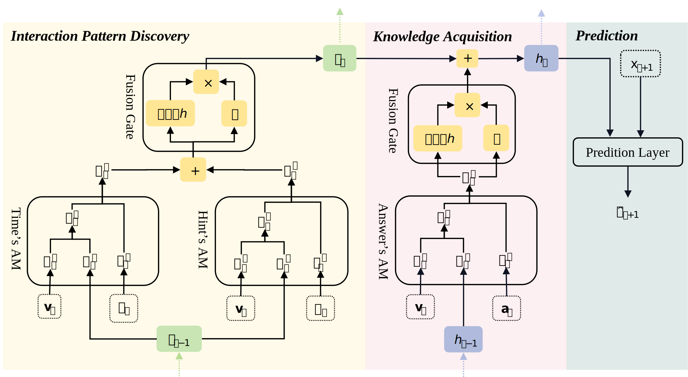

# Improving Knowledge Tracing via Considering Students' Interaction Patterns

Pytorch Implementation

## Architecture


## Usage
0. Put raw data here: `./data/raw/assist[09/12/17]/assist[09/12/17].csv`
1. Use `data/assist09-preprocess.ipynb` to process data. Target format:
    ```csv
    user_id,skill_id,correct,ms_first_response,hint_count,difficulty
    70657,"8,8,3,3","0,0,0,0","63,24,63,24","0,0,0,0","0.84,0.66,0.84,0.66"
    ```

2. Save the processed data here: `./data/processed/assist[09/12/17]/assist[09/12/17]_processed.csv`

3. Run: `python main.py --dataset assist[09/12/17]`